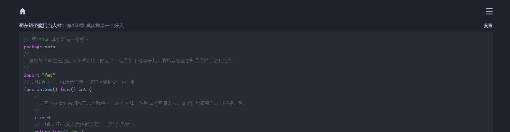
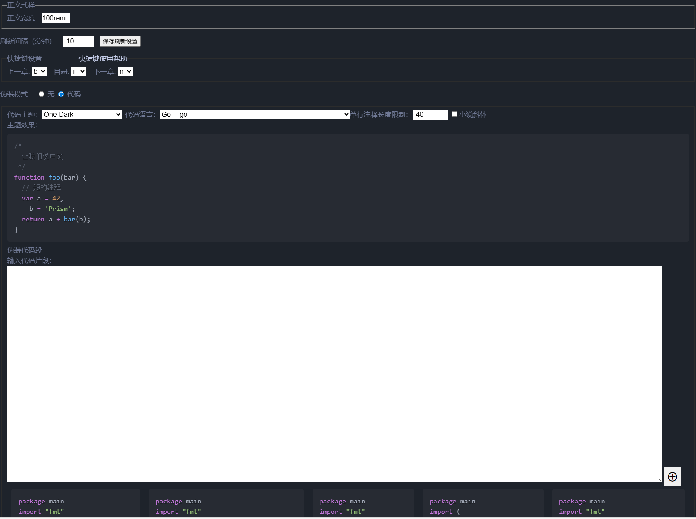

# Deqi Prefetch

[](LICENSE)


一个用于得奇小说网（deqixs.com）的浏览器脚本，可以将小说章节伪装成代码形式展示，并实现免翻页阅读体验。

## 功能特性

- **小说伪装成代码**：将小说内容伪装成各种编程语言的代码形式展示，支持多种编程语言样式
- **免翻页阅读**：自动加载下一章节内容，实现连续阅读体验，无需手动翻页
- **多种代码主题**：支持多种代码高亮主题，可根据个人喜好进行设置
- **快捷键支持**：支持使用快捷键快速跳转到上一章、下一章或目录页
- **自定义配置**：提供设置页面，可自定义代码语言、主题、注释长度等参数

## 预览截图

章节内容伪装成代码效果：


设置页面：


## 安装方式

1. 首先安装浏览器用户脚本管理器，如 [Tampermonkey](https://www.tampermonkey.net/) 或 [Violentmonkey](https://violentmonkey.github.io/)
2. 访问 [Greasy Fork](https://greasyfork.org/zh-CN/scripts/537588-deqi-prefech) 安装脚本
3. 访问 [得奇小说网](https://www.deqixs.com/) 开始使用

## 使用说明

安装脚本后，访问得奇小说网站阅读小说时，章节内容将自动以代码形式展示。脚本会在页面右上角添加"脚本设置"链接，点击可进入设置页面进行个性化配置。

### 支持的代码语言

- JavaScript (默认)
- Python
- C/C++
- C#
- Java
- Go
- Kotlin
- Rust
- PHP
- HTML/CSS

### 快捷键

快捷键功能利用 [accesskey](https://developer.mozilla.org/zh-CN/docs/Web/HTML/Reference/Global_attributes/accesskey#%E5%B0%9D%E8%AF%95%E4%B8%80%E4%B8%8B) 属性实现。 由于不同操作系统和浏览器的差异，快捷键激活方式可能不同：

#### Windows/Linux系统：

##### Chrmome/Edge

- `Alt+H`: 返回目录页
- `Alt+N`: 跳转下一章
- `Alt+B`: 跳转上一章

##### Firefox

- `Alt+Shift+H`: 返回目录页
- `Alt+Shift+N`: 跳转下一章
- `Alt+Shift+B`: 跳转上一章

#### macOS系统：

- `Control+Option+H`: 返回目录页
- `Control+Option+N`: 跳转下一章
- `Control+Option+B`: 跳转上一章

> 注意：某些浏览器可能使用不同的组合键，如果上述快捷键无效，请尝试将 `Alt` 替换为 `Ctrl` 或 `Meta` 键。你也可以在脚本设置页面自定义快捷键。

## 开发

### 技术栈

- TypeScript
- Vite
- Prism.js (代码高亮)
- vite-plugin-monkey (用户脚本构建)

### 本地开发

```bash
# 克隆项目
git clone <项目地址>

# 安装依赖
npm install

# 开发模式
npm run dev

# 构建脚本
npm run build

# 预览构建结果
npm run preview
```

### 项目结构

```
src/
├── main.ts          # 入口文件
├── code.ts          # 代码伪装相关功能
├── config.ts        # 配置相关功能
├── editable-list.ts # 可编辑列表组件
├── style.css        # 样式文件
└── utils.ts         # 工具函数
```

## 许可证

MIT
